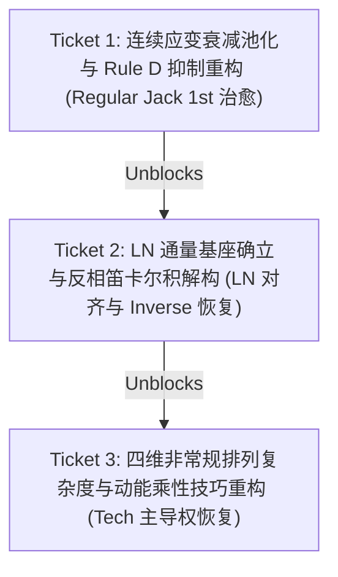

# Phase 2.2 8 维能力雷达物理对齐、连续应变衰减池化与非常规技巧重构规格书

## Problem Statement

在 Phase 2.1 成功完成多押弦叠与切键音符级解耦（ADR-0007）并在 120 首 Jinjin 7K 权威标杆谱面上跑通全量绿色单调性基线后，全景 Dashboard 审计与 `/diagnosing-bugs` 逆向排查暴露了三个破坏雷达语义对齐与段位真实体感的深层物理缺陷：

1. **局部二连叠被全局时长严重稀释，加之交叉抑制过度吞噬（Jack SR = 0.00★ 假死）**：
   在 `Regular Jack 1st`（`dai - dir [Hard]`）中，全曲以流切为主体，但核心考察门槛在于 41 处 16 分音符（$\Delta t = 127\text{ms}, \Delta k = 1$）二连叠与多押和弦的衔接。当前引擎将局部爆发按整曲时长做算术平摊（$\text{jack\_strain\_total} / \text{duration\_s}$），使强度被稀释至 $1.82$；更严重的是，交叉抑制 Rule D 使用生硬的 `jack_ratio < 0.13` 阈值，直接将所有切中带叠的短连叠误判为“切键残留杂音”并扣除 $r_{\text{stream}} \times 0.40 = 5.0$，将 Jack 评级直接清零为 **0.00★**。
2. **反相事件笛卡尔积二次方爆炸，Release 喧宾夺主压制物理长条基座（LN Misalignment）**：
   `src/proj7k/features.py` 中 `antiphase_count` 采用嵌套双循环计算每帧释放轨与按下轨的点对（$O(R \times P)$），导致在 2 押长条换 2 押单点时产生 4 次计数、3 押换 3 押时激增至 9 次。该组合数爆炸导致 `r_ln_rel` 在高密长条中暴涨至 $50 \sim 100$，垄断了全库 **81.7%（49/60）** 的 LN 标杆谱面；代表客观物理长条占据通量的 `ln_general` 被压制在 5★ 以下，且高段位（8th ~ Stellium）的 `ln_inverse` 亦被虚高的 Release 强行夺走主导权。
3. **“技（Tech）”维度脱离速度动能，静态离散度被死锁在个位数（Tech Insignificance）**：
   当前 `r_tech` 仅依赖静态事件率（`gap1_density * 2.0 + adj_density * 0.8`），数值被固化在 $1.5 \sim 8.0$。在 30 NPS 极限高速下，相邻剪切与指间拮抗的生理绞杀没有速度放大乘数，导致 Tech 维度在全部段位中被 $20 \sim 35$ 的 Speed/Stream 完全碾压，雷达分值仅有 1★~2★，彻底脱离了社区对“非常规排列（Unorthodox Permutation）是技巧难度核心”的共识定义。

---

## Solution

根据 ADR-0008 与 `CONTEXT.md` 确立的领域物理模型，本规格书规划三大核心重构支柱，并在后续会话中通过 3 个原子化示踪弹工单（Tracer-bullet Tickets）逐一实施交付。

### 1. 全技能连续应变衰减累积与分位数池化 (Continuous Decay Pooling & Rule D Refactor)
- **拒绝按技能硬编码时间窗**：任何技能在不同谱面中均可表现为瞬间爆发（Burst）或长程耐力（Sustained）。
- **连续指数衰减模型**：
  每个离散击键事件向该技能的连续时间序列注入冲激强度 $\Delta S$，并以人体生理半衰期（$\tau \approx 1.0\text{s} \sim 1.2\text{s}$）平滑指数衰减：
  $$S_k(t) = S_k(t - \Delta t) \cdot e^{-\Delta t / \tau} + \Delta S_k$$
- **多尺度加权分位数池化**：
  $$r_{\text{skill}} = 0.70 \cdot \text{P90}(S_k(t)) + 0.30 \cdot \text{Top5\%Mean}(S_k(t))$$
  - 对于短二连叠爆发：Top 5% 均值敏锐捕捉其局部脉冲，彻底摆脱全曲线性时间稀释；
  - 对于长弦叠耐力：P90 稳健捕获高负荷稳态高原。
- **重构 Rule D 保护切中带叠**：
  废除粗暴的 `jack_ratio < 0.13` 阈值，仅当全谱最大连续停滞步长 $L_{\max} < 2$ 且局域 Jack 峰值应变低于基准底噪时才执行抑制。

### 2. LN 空间通量基座确立与反相笛卡尔积解构 (LN Flux Base & Antiphase Rectification)
- **消除笛卡尔积漏洞**：
  重构 `src/proj7k/features.py` 中 `antiphase_count` 的计算逻辑，由 $O(R \times P)$ 修正为基于时间对齐帧的实际并发物理反相触键数：
  $$\text{antiphase\_events}(\text{tick}) = \min(|\text{released\_cols}|, |\text{pressed\_cols}|)$$
- **确立 `ln_general` 物理通量基座**：
  重塑 $r_{\text{ln\_gen}}$ 为度量全轨长条物理通量与时空占据率的权威基底：
  $$r_{\text{ln\_gen}} = \text{hold\_ratio} \times \text{avg\_nps} \times (1.0 + 0.25 \cdot \text{mean\_concurrent\_holds}) \times \beta_{\text{gen}}$$
- **Release 降级为微观形态修正**：
  $r_{\text{ln\_rel}}$ 量纲回归理性（峰值收敛至 $20 \sim 35$），使其仅在纯高频跳音抬指谱中超越 General；
- **Inverse 自然主导恢复**：
  随着 Release 虚高消除，高段位反键谱面（Stellium 原本 $r_{\text{ln\_inv}} = 48.56$）自然反超 Release 赢回主导权。

### 3. 四维正交非常规排列复杂度与动能乘性技巧耦合 (4D Tech Irregularity & Kinetic Coupling)
- **四维非常规排列度量 $\Omega_{\text{irreg}} \ge 1.0$**：
  对齐社区对“非常规切/叠/速/变奏”的共识定义，由四大正交维度无量纲合成：
  1. **流向紊乱度 (Directional Reversals / Tortuosity)**：连续击键行进方向频繁反转率；
  2. **括号与手内剪切度 (Shear & Bracket Ratio)**：单手内跨距离散度与同手外侧双押/中间单押反相震荡；
  3. **轨位转移空间熵 (Spatial Transition Entropy)**：7 轨间转移概率矩阵信息熵；
  4. **节奏与拍点混乱度 (Rhythmic Irregularity)**：由拍点细分变异熵（1/3、1/4、1/6、12 分混切与切分音）与击键时钟差分抖动率（Micro-timing Jerk）构成。
  $$\Omega_{\text{irreg}} = 1.0 + w_{\text{tort}} \cdot \text{Tortuosity} + w_{\text{brk}} \cdot \text{Bracket} + w_{\text{ent}} \cdot \text{SpatialEntropy} + w_{\text{rhythm}} \cdot \text{RhythmicEntropy}$$
- **动能乘性技巧耦合 (Kinetic Technique Coupling)**：
  从物理底座提取当前谱面的主导动能 $K_{\text{base}} = \max(r_{\text{stream\_raw}}, r_{\text{speed\_raw}}, r_{\text{jack\_raw}})$，技巧强度与底座动能非线性乘性耦合：
  $$r_{\text{tech}} = K_{\text{base}} \times (\Omega_{\text{irreg}} - 1.0)^\gamma \times \lambda_{\text{tech}}$$
  当谱面排列极端复杂或节奏极度混乱时，$r_{\text{tech}}$ 能够自适应跨入 20~30 量纲，在雷达中超越基础物理流判定为 `dominant == 'tech'`。

---

## 跨会话示踪弹工单序列 (Tracer-bullet Tickets)

本规格书拆分为 3 张线性阻塞依赖的工单。每个工单独立成章，可在后续会话中通过 `/implement` 独立构建、TDD 交付并闭环。

---

### Ticket 1: 连续应变衰减池化与 Rule D 抑制重构 (Regular Jack 1st 治愈)
- **ID**: `SPEC-P2.2-01`
- **Blocking**: 无（首顺位）
- **标签**: `ready-for-agent`
- **目标**:
  1. 在 `src/proj7k/radar.py` 中引入 `_compute_continuous_strain_quantile`，计算基于衰减累积（$\tau = 1.0\text{s}$）与 $0.70 \cdot \text{P90} + 0.30 \cdot \text{Top5\%}$ 的通用池化强度；
  2. 重构 $r_{\text{jack}}$ 的原始强度生成逻辑，废除 `/ duration_s` 整曲时间平摊；
  3. 收紧 Rule D：仅在 $L_{\max} < 2$ 且局部 Jack 峰值应变低于底噪门限时才执行切键杂音扣除。
- **验收标准 (Acceptance Criteria)**:
  - `Regular Jack 1st`（`dai - dir [Hard]`）的 Jack 雷达分值从 `0.00★` 恢复至正常区间（$3.2★ \sim 4.2★$）；
  - `SAMBAJACK` (10th) 与 `Identity: Jack` (Gamma) 保持纯 Jack 主导，Stream 分值维持为 $0.00★$；
  - 全量 120 曲跑批单调性守卫持续绿灯（Spearman $\rho \ge 0.98$, Kendall $\tau \ge 0.94$, 逆序数 $\le 20$）。

---

### Ticket 2: LN 通量基座确立与反相笛卡尔积解构 (LN 对齐与 Inverse 恢复)
- **ID**: `SPEC-P2.2-02`
- **Blocking**: Blocked by `SPEC-P2.2-01`
- **标签**: `ready-for-agent`
- **目标**:
  1. 修复 `src/proj7k/features.py` 中 `antiphase_count` 的双重循环笛卡尔积，限制为每物理帧独占匹配 $O(\min(R, P))$；
  2. 重构 `src/proj7k/radar.py` 中的 $r_{\text{ln\_gen}}$，确立其作为长条空间占据通量的权威基座；
  3. 重新标定 $r_{\text{ln\_rel}}$ 系数，使其收敛为微观形态修饰项；
  4. 验证高段位 `LN Inverse` 谱面（8th ~ Stellium）在 Release 降维后是否自然恢复 `dominant == 'ln_inverse'`。
- **验收标准 (Acceptance Criteria)**:
  - `LN General` 15 首标杆谱面的主导维度由原先的 14 首误判为 `ln_release` 彻底逆转为以 `ln_general` 为主体主导；
  - `LN Inverse` 高段位谱面（包括 Stellium Gram - Nibelungen）恢复 `ln_inverse` 主导地位；
  - 全量 120 曲跑批单调性守卫持续绿灯（$\rho \ge 0.98$, $\tau \ge 0.94$, 逆序数 $\le 20$）。

---

### Ticket 3: 四维非常规排列复杂度与动能乘性技巧重构 (Tech 主导权恢复)
- **ID**: `SPEC-P2.2-03`
- **Blocking**: Blocked by `SPEC-P2.2-02`
- **标签**: `ready-for-agent`
- **目标**:
  1. 在 `src/proj7k/features.py` 中增加拍点细分变异熵（Snap Variance Entropy）与时基抖动率（Micro-timing Jerk）抽取，形成节奏混乱度 $R_{\text{rhythm}}$；
  2. 在 `src/proj7k/radar.py` 中构建四维非常规度算子 $\Omega_{\text{irreg}}$（流向紊乱、手内剪切、空间转移熵、节奏混乱度）；
  3. 实现动能乘性技巧耦合算子 $r_{\text{tech}} = K_{\text{base}} \times (\Omega_{\text{irreg}} - 1.0)^\gamma \times \lambda_{\text{tech}}$，并同步扩展至 $r_{\text{ln\_tech}}$；
  4. 跑通全量 120 曲跑批，验证 Regular Tech 与 LN Tech 标杆谱的主导识别率从原先的 0% 跃升为合理主导。
- **验收标准 (Acceptance Criteria)**:
  - `Regular Tech` 标杆谱（如 `Isometry`, `Rengoku`, `Toki`, `Wanderflux`）成功识别为 `tech` 主导；
  - `LN Tech` 标杆谱（如 `CODE -CRiMSON-`, `Hellfire`, `Unleashed World`）成功识别为 `ln_tech` 主导；
  - 规整双流图（如 `Fox4-Raize`, `Triumphal Return`）因 $\Omega_{\text{irreg}} \approx 1.0$ 保持 `stream` 主导，Tech 维持低分，不发生语义漂移；
  - 全量 120 曲跑批全局单调性守卫持续绿灯（$\rho \ge 0.98$, $\tau \ge 0.94$, 逆序数 $\le 20$）。
