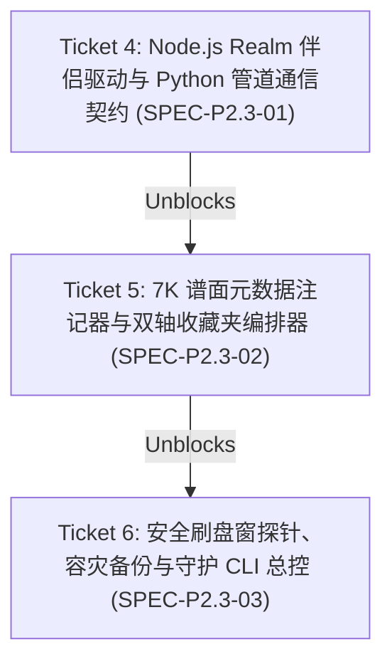

# Phase 2.3 osu!lazer Realm 无损注入、双轴技法收藏夹与常驻守护工具链规格书

## Problem Statement

在 Phase 2.2 闭环 8 维能力雷达与固有难度（Intrinsic SR）综合评级引擎后，系统亟需一个低摩擦、零侵入、原生融合的接入通道，使玩家在日常 osu!lazer 游戏客户端内直接体验并检验评级体系。

直接改写 `.osu` 物理文件存在致命缺陷：它会修改文件哈希（SHA-256 / MD5），导致本地谱面被标记为受损或脏副本，彻底丧失官方联机排行榜匹配与成绩提交资格。此外，osu!lazer 原生搜索解析器无法解析自定义动态属性比较（如 `jack>6.0`），导致玩家难以在游戏内检索特定技法强度的谱面。

## Solution

遵循 [ADR-0009](file:///Users/kz/proj7k/docs/adr/0009-lazer-realm-non-destructive-ingestion-and-node-bridge.md) 与 [`CONTEXT.md`](file:///Users/kz/proj7k/CONTEXT.md)，构建 `proj7k.lazer` 专有子系统与常驻守护进程：
1. **物理文件无损**：原始 `.osu` 文件保持 100% 原始只读，哈希绝对不变；
2. **数据库级注入**：在 `client.realm` 中将 `BeatmapInfo.StarRating` 原地改写为 Intrinsic SR；
3. **视觉与检索三位一体**：
   - `DifficultyName` 后缀注入：`{original} ({SR:.2f}★ {Dan} {Dominant} {version})`（如 `Hard (6.42★ 7th Jack v1a2b3c4d)`），带正则幂等清洗；版本令牌为标定常数派生的方法学哈希（见 [ADR-0014](../../docs/adr/0014-injection-methodology-version-and-reevaluation.md)），供守护进程识别需重评的历史注入；
   - 离散星级桶标签：在 `Metadata.Tags` 注入 `dominant_{tech}` 与 `jack_6★`、`tech_5★` 等；
   - 双轴矩阵收藏夹：自动维护 8 个技法专项收藏夹 + 4 个段位阶梯收藏夹（共 12 个）；
4. **并发与文件锁互斥防护**：通过 POSIX 文件锁监听 `client.realm.lock`，在游戏退出或未启动的安全刷盘窗（Safe Flush Window）瞬间执行原子落盘；
5. **Python-Node 伴侣桥接**：Python 3.14 负责特征抽取与难度计算，通过 stdio JSON 管道驱动轻量级 Node.js Realm 伴侣脚本（`tools/lazer-bridge/bridge.js`）；
6. **容灾与一键还原**：自动生成滚动快照与状态备份，提供 `--revert` 一键还原官方状态。

---

## 模块架构与数据流

```text
src/proj7k/lazer/
├── __init__.py         # 导出 LazerSyncManager, LazerDaemon, IngestionConfig
├── bridge.py           # Node.js Realm 伴侣脚本子进程管道与环境自动 setup
├── annotator.py        # 难度名幂等注记、离散桶 Tags 生成与双轴收藏夹编排
├── lock.py             # POSIX 文件锁状态探针 (Safe Flush Window 判定)
├── backup.py           # 数据库滚动快照管理与 sidecar 原始状态备份/还原
└── daemon.py           # 守护进程总控、快照 Diff 与 CLI 入口 (python3 -m proj7k.sync)

tools/lazer-bridge/
├── package.json        # 声明 realm 依赖
└── bridge.js           # 接收 JSON 命令，执行 Realm 事务批量读写与备份
```

---

## 示踪弹工单序列 (Tracer-bullet Tickets)



### Ticket 4: Node.js Realm 伴侣驱动与 Python 管道通信契约
- **ID**: `SPEC-P2.3-01`
- **目标**:
  1. 搭建 `tools/lazer-bridge/`（`package.json` + `bridge.js`），支持 `dump-7k`（读取 7k 谱面列表）、`update-batch`（原子事务批量写入）与 `revert-batch`；
  2. 在 `src/proj7k/lazer/bridge.py` 中实现 `RealmBridgeClient`，支持自动检测 Node 环境并在初次调用时静默执行 `npm install`；
  3. 编写端到端 Mock 与协议层测试。

### Ticket 5: 7K 谱面元数据注记器与双轴收藏夹编排器
- **ID**: `SPEC-P2.3-02`
- **目标**:
  1. 实现 `src/proj7k/lazer/annotator.py`，严格匹配 `Ruleset.OnlineID == 3 && CS == 7`；
  2. 实现难度名后缀注入与幂等正则剥离函数（`strip_injected_suffix` / `format_injected_difficulty_name`）；
  3. 生成离散桶 Tags（`dominant_{tech}`、`{tech}_{floor_star}★`）；
  4. 编排 12 个双轴收藏夹（8 大技法 + 4 档能力段位）。

### Ticket 6: 安全刷盘窗探针、容灾备份与守护 CLI 总控
- **ID**: `SPEC-P2.3-03`
- **目标**:
  1. 实现 `src/proj7k/lazer/lock.py`，通过 POSIX `fcntl` 无损嗅探 `client.realm.lock` 占用状态；
  2. 实现 `src/proj7k/lazer/backup.py`，管理 `client.realm.backup_<timestamp>` 轮转快照与 `lazer_backup_state.json`；
  3. 实现 `src/proj7k/lazer/daemon.py` 与顶层 CLI（`python3 -m proj7k.sync`），支持 `--once`、`--daemon`、`--revert`、`--setup`；
  4. 编写全链路集成测试与守卫测试。
